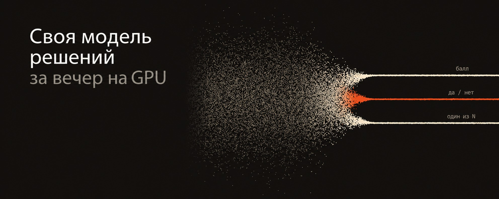
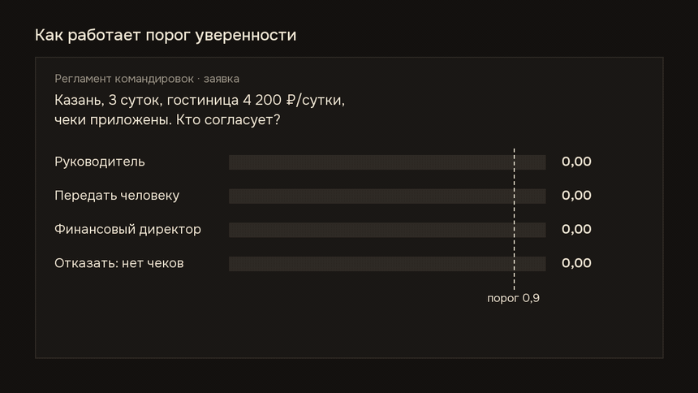
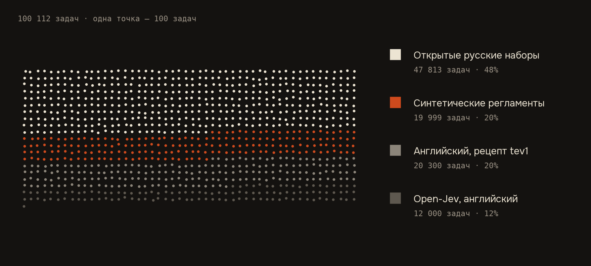
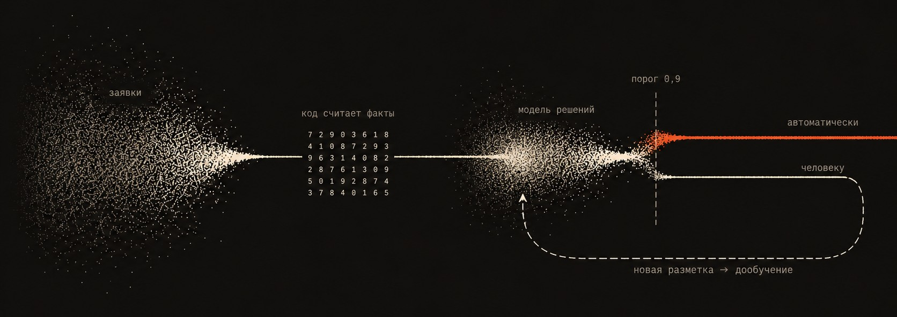

# ru-decision-model: своя модель решений на русском



Код, данные и туториал к модели [**6E6E/ru-decision-4b**](https://huggingface.co/6E6E/ru-decision-4b) — открытой «модели решений» для русского языка.

Модель решений не пишет текст. Она получает **данные**, **вопрос** и **варианты ответа** и за один прямой проход возвращает вероятность каждого варианта — 60–100 мс на одной RTX 4090. Если вероятности откалиброваны, бизнес-правило пишется в одну строку: уверенность выше порога — решение применяется автоматически, ниже — уходит человеку.



**Что в репозитории:** сборка 100 тыс. обучающих задач (открытые русские наборы + синтетические регламенты с разметкой кодом + английская часть), обучение LoRA над Qwen3.5-4B на одной видеокарте, честная оценка (тест без утечек, нейтральный тест, общая калибровка), сравнение с tev1, Kev, Plumb, Imajev, YandexGPT и GigaChat.

**Главный результат:** на русских задачах решений — 84,5% точности и 62,5% потока на автоматике при 95% правильных решений (у базовой модели и аналогов — 0–9%). На задачах, которых не видела ни одна модель, — верхняя группа, но не лидер. Все таблицы — в [results/RESULTS.md](results/RESULTS.md).

---

## Быстрый старт: попробовать готовую модель

Нужна видеокарта с 12+ ГБ памяти.

```bash
pip install "transformers>=5.18" "peft>=0.21" torch accelerate
cd examples
python decide.py                          # три задачи из examples/tasks/
python decide.py tasks/travel-approval.json
```

```text
travel-approval.json {'choice': 'Руководитель.', 'confidence': 0.93, 'auto': True, ...}
```

Своя задача — JSON с полями `state`, `question`, `options` (список описаний вариантов, буквы A, B, C… назначаются сами). `auto: True` — уверенность ≥ 0,9: на отложенных тестах такие решения верны в 95–96% случаев.

---

## Туториал: обучить такую модель самому

### Шаг 0. Что понадобится

| | |
|---|---|
| Видеокарта | одна NVIDIA с 24 ГБ (мы брали арендованную RTX 4090 за 83 ₽/ч с посекундной оплатой) |
| Система | Ubuntu 22.04, CUDA 12.x, Python 3.11 |
| Диск | ~80 ГБ (веса моделей для сравнения занимают больше всего) |
| Время | сборка данных ~30 мин, обучение ~5,5 ч, оценка ~15 мин |
| Деньги | одно обучение — 350–500 ₽ аренды |

Час облачной видеокарты стоит меньше ста рублей. Когда сервер не нужен, ставьте его на паузу (shelve) — платить будете только за диск.

### Шаг 1. Установка

```bash
git clone https://github.com/GG1KENOBI/ru-decision-model
cd ru-decision-model
python3.11 -m venv .venv && source .venv/bin/activate
pip install -r requirements.txt
```

### Шаг 2. Данные

```bash
git clone https://github.com/togethercomputer/tev1 ~/tev1        # английская часть, соберите records по их README
git clone https://github.com/fstandhartinger/jevbench data/jevbench   # публичная часть JevBench для нейтрального теста
TEV1_DIR=~/tev1/data ./data/build_all.sh
```

Что получится — 100 112 обучающих задач:

| Источник | Что решает модель | Задач |
|---|---|---|
| Открытые русские наборы (11 штук) | логический вывод, да/нет по тексту, тональность, рубрика новости и научной статьи, интент, эмоция, здравый смысл | 47 813 |
| Синтетические регламенты (26 типов) | применить бизнес-правило к заявке | 19 999 |
| Английская часть по рецепту tev1 | правила, маршрутизация, интенты банка, тональность, рубрики | 20 300 |
| Open-Jev community-hard-mix (redistributable) | письма, счета, инциденты, длинные документы | 12 000 |



Как устроены синтетические регламенты (`data/policies.py`): правило, заявка и правильный ответ **генерируются кодом**, поэтому разметка всегда верна. Каждый регламент записан пятью стилями (списком, связным текстом, с приоритетами, вперемешку…), факты — полями или живым текстом (`data/narrative.py`). Контрастные пары: заявка меняется в одном факте — ответ должен поменяться. Для правил с арифметикой без готовой проверки правильный ответ — «нужен точный расчёт — передать на проверку».

Формат одной задачи:

```json
{
  "task": "trip", "split": "train",
  "state": "Регламент: ... \nЗаявка: ...",
  "question": "Кто согласует заявку?",
  "options": [{"label": "A", "key": "manager", "description": "Руководитель."}, ...],
  "answer": "A"
}
```

**Проверка утечек встроена.** Каждый следующий набор сверяется с тестами предыдущих: синтетика — по точному хешу, открытые наборы — по нормализованному тексту без чисел. Это не формальность: в одной из первых версий 91 из 200 тестовых задач дословно встречались в обучении, и «90,9% точности» на деле оказались 84,4%.

### Шаг 3. Обучение

```bash
cd gpu
./run_train.sh
```

Внутри — `train_gpu.py`:

- база **Qwen/Qwen3.5-4B**, LoRA r16, alpha 32, все линейные слои;
- 1 эпоха, lr 1e-4 (cosine), батчи по ~16 задач с ограничением по числу токенов;
- функция потерь: кросс-энтропия **только по логитам букв вариантов** + 0,3 × кросс-энтропия по всему словарю на правильной букве;
- валидация каждые 800 шагов, лучшая точка сохраняется в `out/.../best`.

Пик памяти — 20,9 ГБ. На длинных документах может кончиться память: скрипт выставляет `PYTORCH_CUDA_ALLOC_CONF=expandable_segments:True` и пропускает слишком тяжёлый батч. Если обучение всё же упало — продолжите с сохранённой точки флагами `--init-adapter` и `--start-step` (пример в `run_train.sh`).


### Шаг 4. Оценка

```bash
python eval_gpu.py --name mymodel --adapter out/ru-decision-4b/best --data ../data/data_v41 --splits val,test,test_en --tag _v4set
python eval_gpu.py --name mymodel --adapter out/ru-decision-4b/best --data ../data/data_ood --splits calib,test,realistic
python cmp4.py      # свой тест: группы, автоматизация, уверенные ошибки
python cmp_ood.py   # нейтральный тест: общая калибровка для всех моделей
```

`eval_gpu.py` сохраняет логиты по вариантам в `results/<name>_<split>.jsonl`, сравнение считается уже по ним.

Три метрики, которые стоит смотреть вместо голой точности:

1. **Автоматизация при заданной точности.** Сортируем решения по уверенности и берём самые уверенные, пока точность не опустится до 95%. Доля взятого — столько можно отдать модели без людей.
2. **Уверенные ошибки** — уверенность > 0,9, а ответ неверный. Такие ошибки пройдут мимо порога.
3. **Калибровка (ECE)** — совпадает ли заявленная уверенность с реальной. Температура подбирается на отдельной калибровочной выборке.

### Шаг 5. Сравнение с другими моделями

| Модель | Как оценивали |
|---|---|
| Qwen3.5-4B, YandexGPT-5-Lite-8B, GigaChat3.1-10B-A1.8B | `eval_gpu.py --model <репо> --variants` (вероятности «A» и « A» складываются; для моделей с собственным кодом — `--trust`) |
| tev1-4B | `eval_gpu.py --model <репо> --style tev1` — их промпт и формат |
| Kev-4B | `kev_eval.py` через их `LocalPredictor` (bf16) |
| Plumb-4B, Imajev-4B | подняли их собственные серверы и опросили `ts_client.py` по протоколу `/v1/systemone` |
| Эмбеддинги + логрегрессия | `embed_baseline.py` (Giga-Embeddings-instruct) |

Важно: у всех моделей на нейтральном тесте **одна и та же калибровка**, иначе сравнение уверенности нечестное.

### Шаг 6. Публикация

```bash
hf auth login            # токен с правом записи — вводите сами, никому не пересылайте
hf upload <user>/<repo> gpu/out/ru-decision-4b/best . --exclude "train_state.json"
```

Плюс карточка модели (README.md с таблицами и ограничениями) и `examples/decide.py`.

---

## Как встраивать в процесс



1. **Код считает** всё, что можно посчитать: суммы, лимиты, сроки, полноту полей. Модель читает регламент, но не считает — дайте ей готовый факт («сумма превышает лимит: да»).
2. **Модель** получает данные, факты, вопрос и варианты — возвращает вероятности.
3. **Порог**: уверенные решения — автоматически, остальные — сотруднику с подсказкой модели. Порог выбирается под цену ошибки.
4. **Ответы сотрудников** — новая разметка для периодического дообучения. Растёт доля «к человеку» — пора переобучать.

## Четыре ошибки, которые мы сделали

1. **91% оказался 84%** — тест пересекался с обучением. Проверяйте утечки скриптом каждый раз.
2. **Модель уверенно не умеет считать** — «одобрить» с уверенностью 0,98 там, где нужна арифметика. Решение: код считает, модель читает.
3. **Перестраховка** — научившись говорить «данных недостаточно», модель стала отдавать человеку почти все компенсации, записанные свободным текстом.
4. **Учить дольше — не значит лучше** — своя валидация росла до последнего шага, а реалистичные задачи и автоматизация падали. Выбирайте версию по независимому тесту, а правило выбора фиксируйте заранее.

## Ограничения

- Синтетические регламенты вымышлены: на ваших регламентах проверьте качество на собственной разметке (300–500 примеров).
- Многошаговую арифметику выносите в код.
- Не используйте как единственное основание для решений о людях (найм, кредиты, увольнения).
- Устойчивость к инструкциям внутри `state` (prompt injection) специально не измерялась.

## Лицензии

Код — Apache-2.0. Модель — Apache-2.0, база Qwen3.5-4B — Apache-2.0.
Данные собираются скриптами из исходных наборов под их лицензиями: TERRa, RCB, DaNetQA, MERA, RuSciBench, Кинопоиск, заголовки (MIT); ru-reviews, CEDR (Apache-2.0); MASSIVE (CC BY 4.0, © Amazon, FitzGerald et al., 2022); Open-Jev community-hard-mix redistributable (CC0 / CC BY 4.0); английская часть — источники рецепта tev1 под своими лицензиями. Набор ai-forever/inappropriateness-classification (CC BY-NC-SA 4.0) используется **только в тесте**.

---

Сделано в [айфи.студио](https://aify.studio) — внедряем ИИ в бизнес там, где сотрудники тратят часы на однотипную работу.
