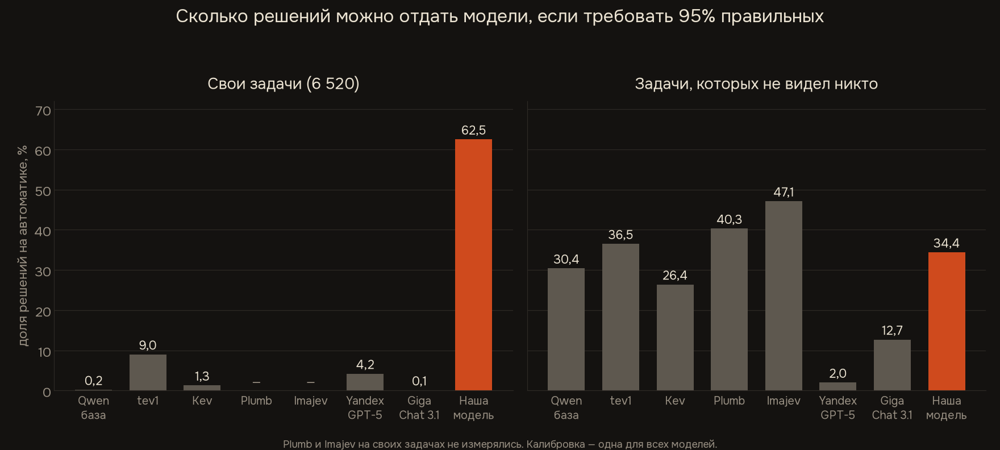
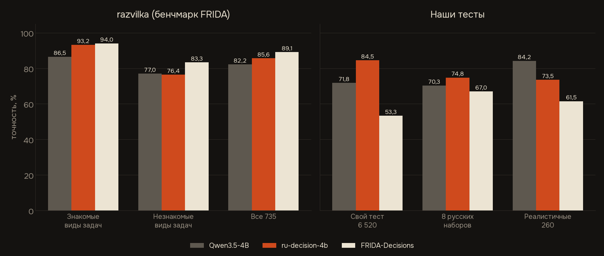
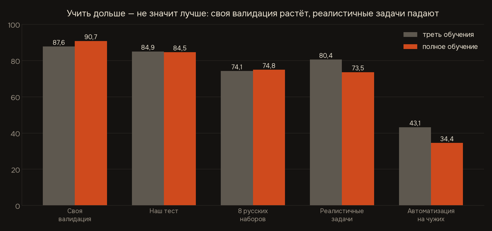
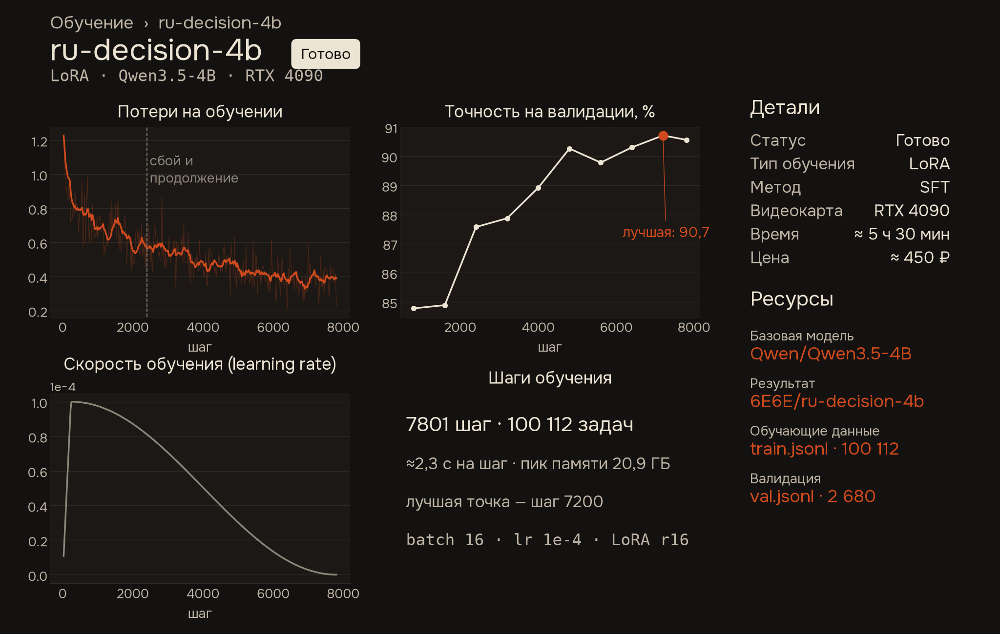

# Результаты ru-decision-4b

Все тесты — отложенные выборки, проверенные на пересечения с обучением. Вероятности — один прямой проход, softmax по буквам вариантов.

**Автоматизация при 95%** — доля решений, которую можно отдать модели, если требовать 95% точности среди них (решения берутся по убыванию уверенности).
**Уверенные ошибки** — доля ответов с уверенностью > 0,9, которые оказались неверными.

## 1. Русские задачи решений — 6 520 задач

Открытые русские наборы и бизнес-регламенты новых типов, которых не было в обучении. Синтетика того же генератора, что в обучении, и задачи с найденной утечкой сюда не входят. Скрипт — `gpu/cmp4.py`, температура подобрана на валидации каждой модели.

| | Qwen3.5-4B (база) | tev1-4B | Kev-4B | YandexGPT-5-Lite-8B | GigaChat3.1-10B-A1.8B | **ru-decision-4b** |
|---|---|---|---|---|---|---|
| Открытые русские наборы (TERRa, RCB, DaNetQA, отзывы, заголовки, MASSIVE) | 75,6 | 76,3 | 77,6 | 77,2 | 75,9 | **86,3** |
| Новые русские наборы (Кинопоиск, RuSciBench, CEDR, PARus, ruOpenBookQA, ruWorldTree) | 79,0 | 78,2 | 71,4 | 80,2 | 76,9 | **86,3** |
| Модерация (тип задачи не из обучения) | 72,2 | 69,8 | 67,5 | **81,2** | 71,0 | 60,2 |
| Регламенты новых типов | 57,2 | 64,7 | 67,3 | 44,5 | 43,3 | **86,3** |
| Те же регламенты, трудные стили записи | 56,2 | 70,9 | 66,9 | 45,6 | 47,3 | **84,2** |
| Регламенты с проверками, посчитанными кодом | 71,3 | 78,7 | 82,5 | 49,5 | 70,3 | **98,3** |
| Правило требует расчёта без готовой проверки → «передать на проверку» | 7,5 | 17,5 | 12,5 | 3,5 | 7,0 | **92,5** |
| **Точность, итого** | 71,8 | 74,7 | 73,1 | 69,0 | 68,9 | **84,5** |
| **Автоматизация при 95%** | 0,2% | 9,0% | 1,3% | 4,2% | 0,1% | **62,5%** |
| Уверенные ошибки | 1,8% | **1,2%** | 3,5% | 29,2% | 16,5% | 3,9% |

YandexGPT и GigaChat — без дообучения, по вероятностям букв ответа («A» + « A»).

## 2. Задачи, которых не видела ни одна модель

8 русских наборов, 260 реалистичных задач, написанных вручную, и публичная часть JevBench (231, англ.). Калибровка — одна для всех моделей, на отдельных 800 задачах. Скрипт — `gpu/cmp_ood.py`.

| | Qwen3.5-4B | tev1-4B | Kev-4B | Plumb-4B | Imajev-4B | YandexGPT-5-Lite-8B | GigaChat3.1-10B | **ru-decision-4b** |
|---|---|---|---|---|---|---|---|---|
| Banking77-ru (77 классов) | 83,8 | 78,2 | 76,2 | 90,0 | 90,4 | 84,2 | 86,0 | **93,1** |
| Жалобы граждан: ведомство | 85,0 | 89,5 | 85,2 | 83,8 | 87,5 | 79,2 | 78,8 | **90,0** |
| Жалобы граждан: срочность | 40,3 | 39,0 | 39,3 | 40,7 | **43,7** | 38,0 | 28,0 | 41,7 |
| Токсичность в поддержке | 86,2 | 92,2 | 91,0 | **93,8** | 89,2 | 91,8 | 86,8 | 89,5 |
| Georeview: оценка 1–5 | 54,8 | 57,5 | **61,5** | 56,2 | 58,0 | 56,2 | 47,5 | 58,5 |
| RuCoLA | **73,2** | 69,2 | 70,2 | 71,0 | 70,0 | 72,2 | 68,5 | 69,5 |
| RWSD | 64,7 | 68,1 | 70,6 | 74,0 | 73,5 | 70,6 | 67,6 | **74,5** |
| ruHateSpeech | 74,4 | 85,6 | 74,0 | **86,5** | 85,6 | 85,6 | 84,7 | 81,4 |
| **Среднее по 8 русским наборам** | 70,3 | 72,4 | 71,0 | 74,5 | 74,7 | 72,2 | 68,5 | **74,8** |
| Реалистичные задачи (260) | 84,2 | **86,5** | 82,3 | 83,8 | 83,1 | 84,2 | 81,9 | 73,5 |
| JevBench public (231, англ.) | 79,7 | 76,6 | 71,9 | **88,3** | 86,1 | 67,1 | 67,1 | 75,3 |
| Автоматизация при 95% | 30,4 | 36,5 | 26,4 | 40,3 | **47,1** | 2,0 | 12,7 | 34,4 |
| Уверенные ошибки | 1,3 | 1,1 | **0,6** | 1,5 | 0,9 | 2,8 | 2,3 | 1,8 |

Наш замер JevBench совпадает с публичным рейтингом: Imajev 86,1 (в рейтинге 86,1), Plumb 88,3 (89,6).

## 3. Сравнение с FRIDA-Decisions (SberAI)

[FRIDA-Decisions](https://huggingface.co/ai-forever/FRIDA-Decisions) — модель решений на энкодере FRIDA (823M, MIT). Оценивали в обе стороны: обе модели на их бенчмарке [razvilka](https://huggingface.co/datasets/artemsnegirev/razvilka) (735 задач, 15 видов) и FRIDA на наших тестах. Скрипты: `gpu/razv_convert.py` (razvilka в наш формат), `gpu/frida_eval.py` (FRIDA на всех наборах, отдельное окружение `pip install "frida-decisions[torch] @ git+https://github.com/ai-forever/FRIDA-Decisions@v0.4.0"`).

8 из 15 видов задач razvilka собраны из тех же открытых наборов, на обучающих частях которых училась наша модель (тестовые части, дословных совпадений 4 из 735), поэтому они посчитаны отдельно.

| razvilka | Qwen3.5-4B | ru-decision-4b, шаг 2400 | ru-decision-4b | FRIDA-Decisions |
|---|---|---|---|---|
| Знакомые виды задач (8 видов, 400) | 86,5 | 92,5 | 93,2 | **94,0** |
| Незнакомые виды задач (7 видов, 335) | 77,0 | 81,5 | 76,4 | **83,3** |
| **Все 735** | 82,2 | 87,5 | 85,6 | **89,1** |

| Наши тесты | ru-decision-4b | FRIDA-Decisions |
|---|---|---|
| Свой тест, 6 520 | **84,5** | 53,3 |
| в т. ч. регламенты новых типов | **86,3** | 25,7 |
| Автоматизация при 95% (свой тест) | **62,5%** | 1,1% |
| 8 русских наборов (нейтральный тест) | **74,8** | 67,0 |
| Реалистичные задачи (260) | **73,5** | 61,5 |
| JevBench (англ.) | **75,3** | 57,6 |
| Автоматизация при 95% (нейтральный тест) | **34,4%** | 18,5% |

Вывод: для классификации по коротким меткам (тема, тональность, модерация, интент) FRIDA-Decisions точнее и в разы быстрее; для применения регламентов к заявкам нужна дообученная модель побольше.

## 4. Английский: тест рецепта tev1

| | Qwen3.5-4B | tev1-4B | Kev-4B | **ru-decision-4b** |
|---|---|---|---|---|
| Основной (1000) | 781 | 879 | 816 | **883** |
| Перенос политик (300) | 166 | **300** | 233 | 293 |

## 5. Треть обучения против полного

Обучение один раз упало на шаге ~3200 (CUDA OOM). Промежуточную точку (шаг 2400) успели оценить, потом доучили до конца.

| | Шаг 2400 (треть) | Шаг 7200 (опубликована) |
|---|---|---|
| Своя валидация | 87,6 | **90,7** |
| Тест из п. 1 | **84,9** | 84,5 |
| razvilka (735) | **87,5** | 85,6 |
| 8 русских наборов | 74,1 | **74,8** |
| Реалистичные задачи | **80,4** | 73,5 |
| Автоматизация на чужих задачах | **43,1%** | 34,4% |

## 6. Перестраховка на компенсациях

Реалистичные обращения про компенсации («в салате нашёл волос» → «привезти замену»): регламент и жалоба одним свободным текстом.

| | Qwen3.5-4B | ru-decision-4b |
|---|---|---|
| С вариантом «передать человеку» | 80,0 | 13,3 |
| Без этого варианта | 93 | 48 |

Модель выбирает «передать человеку», потому что в синтетике «недостаточно данных» означало «пропущено поле». Лучше передавать факты отдельными полями и использовать порог уверенности.

## Обучение

Логи — `logs/train_v41_part1.log` (до сбоя) и `logs/train_v41_part2_resume.log` (продолжение с шага 2400).
